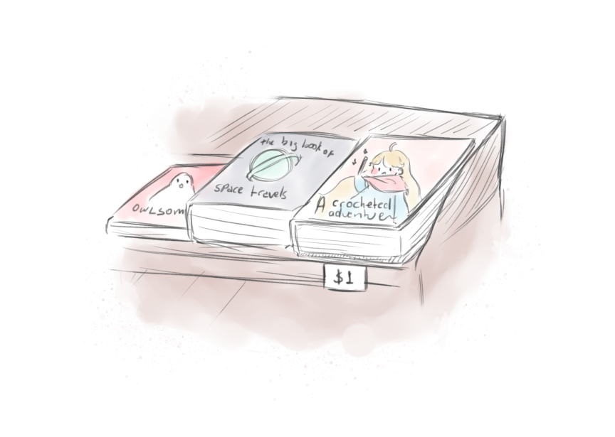

=====================
A Crocheted Adventure
=====================

.. note::

   This book is very raw, unedited, and... unfinished? Keep any expectations
   you may have as low as possible and you might still enjoy it :)

It had been a while since your last trip to a second-hand bookshop. In
the past you'd always marvel at the little treasures you'd find in them,
and the sometimes non-sensical way they were organised---though each one
of them was unique in its own right in that part.

Today's trip had proven useful. In one of your hands you carried some
beaten-but-still-lovable copies of the classics in editions that were 
now long out of print. Alice's wonderland would find a new home in your
bookshelf, and live an extended, happy life.

You turn right in one of the aisles and you... stop. "What's this...?"
In front of you there was a small stand of mismatched titles. Not only did
their sizes and bindings differ, their topics and generes were nothing
like each other. And they certainly didn't look like antiques---if anything,
these could very well be brand new editions, or at least they looked the
part.

         From left to right, the---you presume---comedy novella "Owlsome",
         followed by a fun scientific treatise under the name of
         "The Big Book of Space Travels," and finally a sizable book
         featuring a... cozy magician? Perhaps a fantasy book.

The last book's title catch your attention immediately. You've always had
a soft spot for fantasy novels. And this one seemed like one of those...
advanced books? No. What was it called again? Adventure! Yes, one of
those adventure books, where you could even affect how the story would
progress with your choices, no longer remaining a passive reader.

You read the title out loud, a past habit, "A Crocheted Adventure". Well,
it does *sound* cozy. And the person on the cover certainly looks very
comfy. You wonder what kind of setting it could have. And what kind of
magic the author had imagined for this world.

Your eyes move on to the price below it in the shelf... $1? By the heavens,
that was *cheap*. But maybe there was something odd about these books. After
all, they were here on the side, being given out almost for free, all while
looking brand new.

You run your fingers through the hard cover---you could feel the illustration
beneath, the lines raised on the paper. An embossed hard cover wasn't an
everyday encounter. Your curiosity rises.

:doc:`"Maybe if I take a peek inside..." <intro/001>`

----

.. tip::

   A the end of the section you may come across little snippets like
   this one. They'll describe ways of achieving what was discussed in
   the section more efficiently---or just provide an alternative way of doing it.
   They're at the end of the section so the flow of the text isn't broken.

.. toctree::
   :hidden:

   intro/index
   ch01/index