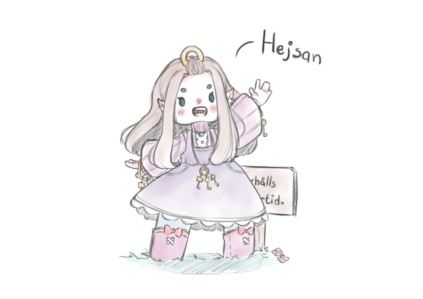

Who are you?
============

"Oh!" You hear someone exclaim behind you. A high pitched voice.
When you turn around, you see a short person holding many keys
in their hands, a curious look on their face. You blink, they
walk closer, stand on the tip of their toes, bring their face
nearer. "Are you, by any chance, an adventurer?"

An adventurer! Now it's been a while since you've heard *that*
one. It's not how you'd generally describe yourself, at least.
You were a programmer. You knew a bit about functional
programming (okay, *maybe* you knew more than a bit about
functional programming).

But, well, you were venturing into the Spire. "I suppose
you could say that, yes," you tell the short person. "Are you
an adventurer as well? What's up with all those keys?"

They're taken aback for a moment. "Oh? Me? Oh, no. No. I'm
just the gatekeeper. My name's Sellaris."

"Gatekeeper," you repeat under your breath. It made sense. Of
course a gatekeeper would have many keys with them. An idea
popped in your head almost immediately upon this realisation.
:doc:`"Hey, do you know how I can get inside?" <003>`